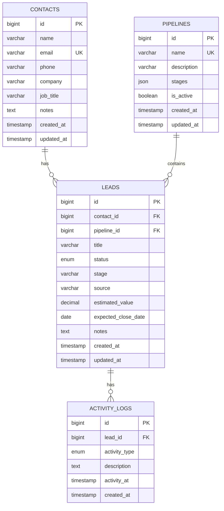

# Finalized Entity Relationship Diagram

The schema contains exactly the four required business entities:

- `contacts`
- `pipelines`
- `leads`
- `activity_logs`

## ERD

## Relationship decisions

### Contact → Leads
**1-to-many.** A contact can have multiple CRM opportunities/leads. Each lead must belong to one contact.

### Pipeline → Leads
**1-to-many.** A pipeline contains many leads. Each lead must belong to one pipeline.

### Lead → Activity Logs
**1-to-many.** A lead can have many calls, emails, meetings, notes, tasks, or status-change events.

### Pipeline stages
The four-entity requirement does not include a separate `pipeline_stages` entity. To avoid introducing an extra table outside the assigned scope, pipeline stage configuration is stored as a JSON array in `pipelines.stages`, while each lead stores its current stage in `leads.stage`.

This keeps the required schema within the four specified entities while allowing each pipeline to define its own stages.

## Referential integrity

- `leads.contact_id` → `contacts.id` with `ON DELETE RESTRICT`
- `leads.pipeline_id` → `pipelines.id` with `ON DELETE RESTRICT`
- `activity_logs.lead_id` → `leads.id` with `ON DELETE CASCADE`

The restrictive lead relationships prevent accidental deletion of contacts/pipelines that still have leads. Activity logs are deleted automatically when their parent lead is deleted.
